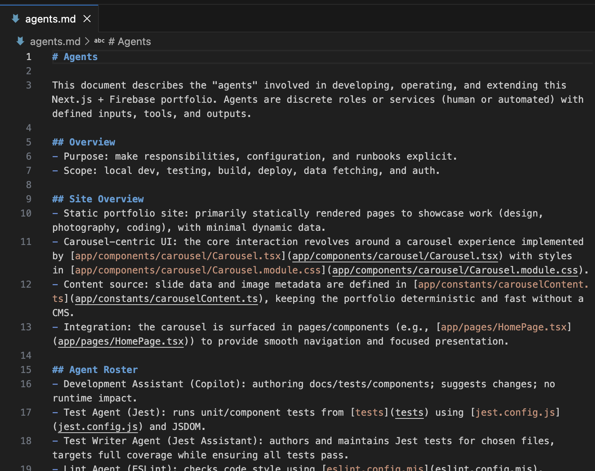
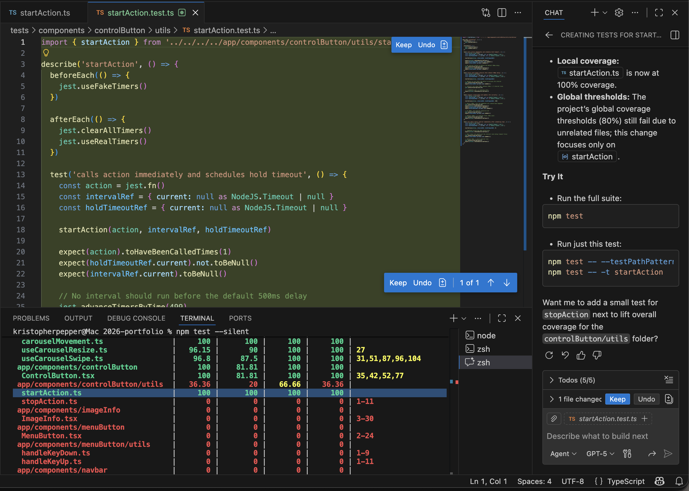
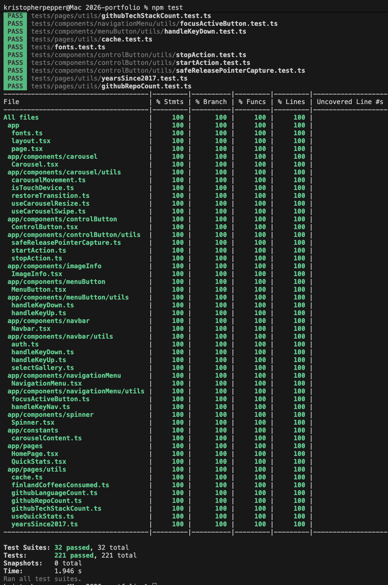

# 1. 2026 Portfolio

Check out my portfolio site:  
https://portfolio-2a913.web.app/

---

## Table of Contents

1. [Intro](#1-intro)  
2. [Accessibility](#2-accessibility)  
3. [AI](#3-ai)  
4. [Security](#4-security)  
5. [Technology](#5-technology)  
6. [Tests](#6-tests)  
7. [UI](#7-ui)

---

## 1. Intro

<strong>Overview</strong>

I made a new portfolio site to showcase my **photography**, **coding**, and **design** work.  
The project emphasizes accessibility, security, and clean, maintainable code.

---

## 2. Accessibility

<strong>2.1 Keyboard Controls</strong>

The site supports full keyboard navigation, ensuring smooth and accessible interactions for users who rely on keyboard input.

**Desktop experience:**  

https://private-user-images.githubusercontent.com/98150294/529599251-ab882cd4-b776-42f3-a216-713162b9e9ce.mov?jwt=eyJ0eXAiOiJKV1QiLCJhbGciOiJIUzI1NiJ9.eyJpc3MiOiJnaXRodWIuY29tIiwiYXVkIjoicmF3LmdpdGh1YnVzZXJjb250ZW50LmNvbSIsImtleSI6ImtleTUiLCJleHAiOjE3NjY3OTAxODksIm5iZiI6MTc2Njc4OTg4OSwicGF0aCI6Ii85ODE1MDI5NC81Mjk1OTkyNTEtYWI4ODJjZDQtYjc3Ni00MmYzLWEyMTYtNzEzMTYyYjllOWNlLm1vdj9YLUFtei1BbGdvcml0aG09QVdTNC1ITUFDLVNIQTI1NiZYLUFtei1DcmVkZW50aWFsPUFLSUFWQ09EWUxTQTUzUFFLNFpBJTJGMjAyNTEyMjYlMkZ1cy1lYXN0LTElMkZzMyUyRmF3czRfcmVxdWVzdCZYLUFtei1EYXRlPTIwMjUxMjI2VDIyNTgwOVomWC1BbXotRXhwaXJlcz0zMDAmWC1BbXotU2lnbmF0dXJlPTQzMzFiMjIwYWFiN2M2YjU1MDIyYzAzMmIzYmU0NWM3NWIyOGIwYjVlYzYzMzE4MjM1NzI1MmZmNDk0NjQyMTgmWC1BbXotU2lnbmVkSGVhZGVycz1ob3N0In0.4t-3nrx96TF99uaenm6RJpoHd1icla-fF438CMrgQJI

<strong>2.2 Mobile Accessibility</strong>

- The carousel supports natural swipe gestures on mobile devices.
- The layout is fully responsive across mobile portrait/landscape, tablets, and widescreen displays.

**Mobile experience:**  

https://private-user-images.githubusercontent.com/98150294/529791491-3bdbbfc4-c055-474c-9572-726794ede486.mov?jwt=eyJ0eXAiOiJKV1QiLCJhbGciOiJIUzI1NiJ9.eyJpc3MiOiJnaXRodWIuY29tIiwiYXVkIjoicmF3LmdpdGh1YnVzZXJjb250ZW50LmNvbSIsImtleSI6ImtleTUiLCJleHAiOjE3NjY3OTAwODQsIm5iZiI6MTc2Njc4OTc4NCwicGF0aCI6Ii85ODE1MDI5NC81Mjk3OTE0OTEtM2JkYmJmYzQtYzA1NS00NzRjLTk1NzItNzI2Nzk0ZWRlNDg2Lm1vdj9YLUFtei1BbGdvcml0aG09QVdTNC1ITUFDLVNIQTI1NiZYLUFtei1DcmVkZW50aWFsPUFLSUFWQ09EWUxTQTUzUFFLNFpBJTJGMjAyNTEyMjYlMkZ1cy1lYXN0LTElMkZzMyUyRmF3czRfcmVxdWVzdCZYLUFtei1EYXRlPTIwMjUxMjI2VDIyNTYyNFomWC1BbXotRXhwaXJlcz0zMDAmWC1BbXotU2lnbmF0dXJlPWQwOWIxMTMyN2Y1NDliMDQ3ODIxNzI2MjdiZTA2OWQ0MDlkYzg3ZWZjZDY2NjZiMWVkYzM2ZDQxZjlhYmU0ZjAmWC1BbXotU2lnbmVkSGVhZGVycz1ob3N0In0.tcTPiAvubiKjCx0BuWglR8E_Pir0f6Og4DxUzWsjLO0

---

## 3. AI

<strong>3.1 Agents Markdown File</strong>

- An `agents.md` file has been created to help make agent interactions smoother and more efficient.

<strong>3.2 Test Writing</strong>

- GitHub Copilot was used to assist in writing tests and achieving high code coverage.

---

## 4. Security

<strong>4.1 Security Headers</strong>

- Security headers are implemented to help mitigate common web-based threats.

<strong>4.2 Sign-in</strong>

- Due to the risk of AI misuse of facial data, subjects’ faces are censored by default.
- Uncensored images are protected behind a sign-in feature.

---

## 5. Technology

<strong>Tech Stack</strong>

| Category      | Tools / Services |
|---------------|------------------|
| AI Assistance | GitHub Copilot   |
| Framework     | Next.js          |
| Hosting       | Firebase         |
| Language      | TypeScript       |
| Styling       | CSS              |

---

## 6. Tests

<strong>6.1 Jest</strong>

Jest is used to maintain code quality and verify application functionality.

---

## 7. UI

<strong>7.1 Bespoke Components</strong>

All UI components were custom-built by me, with selective AI assistance, to meet the project’s specific requirements.

