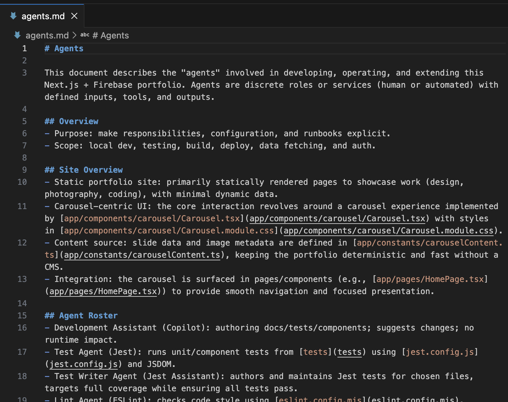
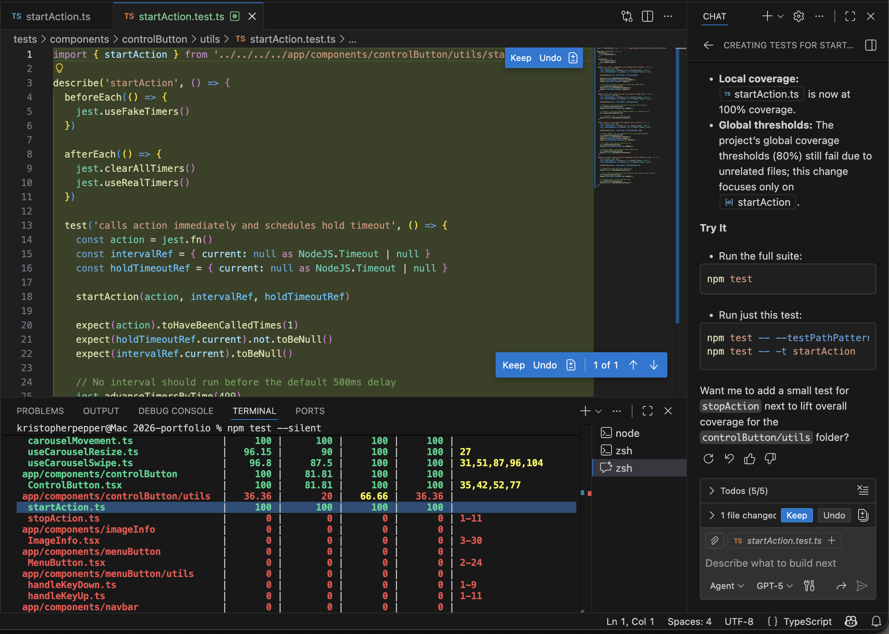
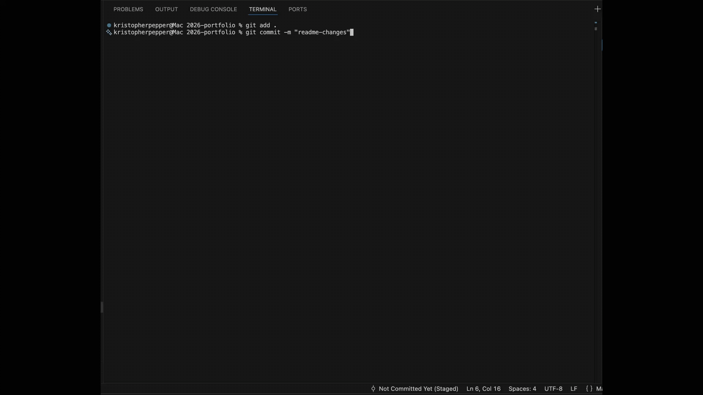
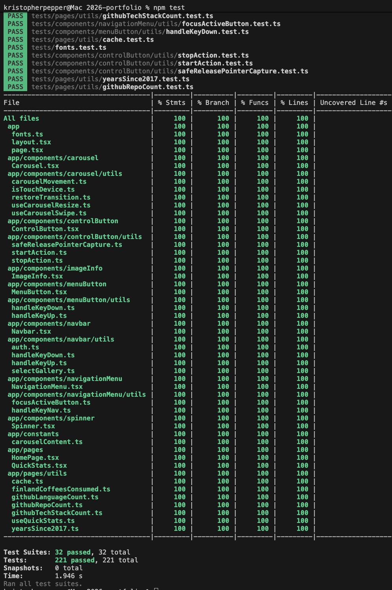

# 2026 Portfolio

Check out my portfolio site!  
https://portfolio-2a913.web.app/

---

## Table of Contents

1. [Intro](#1-intro)  
2. [Accessibility](#2-accessibility)  
3. [AI](#3-ai)
4. [Git Hook Manager](#4-git-hook-manager)
5. [Security](#5-security)  
6. [Technology](#6-technology)  
7. [Tests](#7-tests)  
8. [UI](#8-ui)

---

## 1. Intro

<strong>1.1 Overview</strong>

I made a new portfolio site to showcase my **photography**, **coding**, and **design** work. The site is a simple carousel which can handle both images and TSX. The active gallery dictates the current content populating the carousel. The active gallery can be changed via the menu. New portfolio content can be added by adding images and a single line of code.

---

## 2. Accessibility

<strong>2.1 Keyboard Controls</strong>

The site supports full keyboard navigation, ensuring smooth and accessible interactions for users who rely on keyboard input.

**Desktop experience:**  

https://private-user-images.githubusercontent.com/98150294/529599251-ab882cd4-b776-42f3-a216-713162b9e9ce.mov?jwt=eyJ0eXAiOiJKV1QiLCJhbGciOiJIUzI1NiJ9.eyJpc3MiOiJnaXRodWIuY29tIiwiYXVkIjoicmF3LmdpdGh1YnVzZXJjb250ZW50LmNvbSIsImtleSI6ImtleTUiLCJleHAiOjE3NjY3OTAxODksIm5iZiI6MTc2Njc4OTg4OSwicGF0aCI6Ii85ODE1MDI5NC81Mjk1OTkyNTEtYWI4ODJjZDQtYjc3Ni00MmYzLWEyMTYtNzEzMTYyYjllOWNlLm1vdj9YLUFtei1BbGdvcml0aG09QVdTNC1ITUFDLVNIQTI1NiZYLUFtei1DcmVkZW50aWFsPUFLSUFWQ09EWUxTQTUzUFFLNFpBJTJGMjAyNTEyMjYlMkZ1cy1lYXN0LTElMkZzMyUyRmF3czRfcmVxdWVzdCZYLUFtei1EYXRlPTIwMjUxMjI2VDIyNTgwOVomWC1BbXotRXhwaXJlcz0zMDAmWC1BbXotU2lnbmF0dXJlPTQzMzFiMjIwYWFiN2M2YjU1MDIyYzAzMmIzYmU0NWM3NWIyOGIwYjVlYzYzMzE4MjM1NzI1MmZmNDk0NjQyMTgmWC1BbXotU2lnbmVkSGVhZGVycz1ob3N0In0.4t-3nrx96TF99uaenm6RJpoHd1icla-fF438CMrgQJI

<strong>2.2 Mobile Accessibility</strong>

- The carousel supports natural swipe gestures on mobile devices.
- The layout is fully responsive across mobile portrait/landscape, tablets, and widescreen displays.

**Mobile experience:**  

https://private-user-images.githubusercontent.com/98150294/529791491-3bdbbfc4-c055-474c-9572-726794ede486.mov?jwt=eyJ0eXAiOiJKV1QiLCJhbGciOiJIUzI1NiJ9.eyJpc3MiOiJnaXRodWIuY29tIiwiYXVkIjoicmF3LmdpdGh1YnVzZXJjb250ZW50LmNvbSIsImtleSI6ImtleTUiLCJleHAiOjE3NjY3OTAwODQsIm5iZiI6MTc2Njc4OTc4NCwicGF0aCI6Ii85ODE1MDI5NC81Mjk3OTE0OTEtM2JkYmJmYzQtYzA1NS00NzRjLTk1NzItNzI2Nzk0ZWRlNDg2Lm1vdj9YLUFtei1BbGdvcml0aG09QVdTNC1ITUFDLVNIQTI1NiZYLUFtei1DcmVkZW50aWFsPUFLSUFWQ09EWUxTQTUzUFFLNFpBJTJGMjAyNTEyMjYlMkZ1cy1lYXN0LTElMkZzMyUyRmF3czRfcmVxdWVzdCZYLUFtei1EYXRlPTIwMjUxMjI2VDIyNTYyNFomWC1BbXotRXhwaXJlcz0zMDAmWC1BbXotU2lnbmF0dXJlPWQwOWIxMTMyN2Y1NDliMDQ3ODIxNzI2MjdiZTA2OWQ0MDlkYzg3ZWZjZDY2NjZiMWVkYzM2ZDQxZjlhYmU0ZjAmWC1BbXotU2lnbmVkSGVhZGVycz1ob3N0In0.tcTPiAvubiKjCx0BuWglR8E_Pir0f6Og4DxUzWsjLO0

---

## 3. AI

<strong>3.1 Agents Markdown File</strong>

- An `agents.md` file has been created to help make agent interactions smoother and more efficient.

<strong>3.2 Test Writing</strong>

- GitHub Copilot was used to assist in writing tests and achieving high code coverage.

---

## 4. Git Hook Manager

<strong>4.1 Commit Tests</strong>

I used Husky to run "npm test" whenever I try to "commit" my work. If the tests fail then the commit does too. With this I have tried to reduce the chance of pushing breaking code.

---

## 5. Security

<strong>5.1 Security Headers</strong>

- Security headers are implemented to help mitigate common web-based threats.

<strong>5.2 Sign-in</strong>

- Due to the risk of AI misuse of facial data, subjects’ faces are censored by default.
- Uncensored images are protected behind a sign-in feature.

---

## 6. Technology

<strong>Tech Stack</strong>

| Category      | Tools / Services |
|---------------|------------------|
| AI Assistance | GitHub Copilot   |
| Framework     | Next.js          |
| Git Commit Manager     | Husky          |
| Hosting       | Firebase         |
| Language      | TypeScript       |
| Styling       | CSS              |
| Testing       | Jest             |

---

## 7. Tests

<strong>7.1 Jest</strong>

Jest is used to maintain code quality and verify application functionality.

---

## 8. UI

<strong>8.1 Bespoke Components</strong>

All UI components were custom-built by me, with selective AI assistance, to meet the project’s specific requirements.

